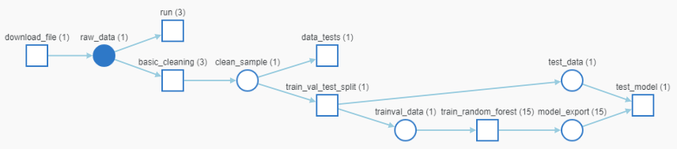

# Building an end-to-end ML Pipeline for Short-Term Rental Prices in NYC

## Project Details

**Material and links:**
 * [Original instructions](doc/instructions.md)
 * [WandB project (luckyluks/nyc_airbnb)](https://wandb.ai/luckyluks/nyc_airbnb)

### Description:
In this project, as part of the [Udacity ML Devops Nanodegree](https://www.udacity.com/course/machine-learning-dev-ops-engineer-nanodegree--nd0821), an end to end ML pipeline was developed to predict the typical property rental price of a given property using scikit-learn, mlflow and weights and biases. To achieve this, a scikit-learn random forest model was trained based on the data samples of similiar properties.

### Focus:
In this project, the overall project focus was to develop the step components for the end to end pipeline, track experiment runs and artifacts. In contrast, the explorative analysis and modeling to achieve the best performing model was not the focus.

### Illustration:
The final pipeline is illustrated in the following image, as generated by WandB graph view (squares are pipeline step components, circles mark output artifacts)



### Stack:
The following tools create the stack for the pipeline:
- [[Github](https://github.com/)] as code base repository, including the versioning of code
- [[Weights & Biases (WandB)](https://wandb.ai/)] as the remote tracking and versioning system for datasets, notebooks, configurations and resulting metrics as a result of a runned training experiment
- [[MLflow](https://mlflow.org/)] as an ML platform framework, used for the packaging of pipeline components in a standardized way (MLflow projects) and for packaging the model itself (MLflow models)
- [[Conda](https://conda.io)] as dependency system framework, resolves dependencies and ensure isolated environments for any component of the pipeline
- [[Hydra](https://hydra.cc/)] as configuration management framework, to enable central configuration that is easy to track, use and overwrite. Additionally to perform basic parameter sweeps
- [[Scikit-learn](https://scikit-learn.org/)] a modeling framework for machine learning models
- [[pytest](https://docs.pytest.org/)] a python test module, to do some simple checks on the incoming training data

### Code Base:
in the following a simplified version of the code base structure is described:

```
.
├── MLproject: the overall pipeline MLflow project config
├── components: includes a copy of referenced components from the forked Udacity project starter
├── conda.yml: the overall pipeline conda dependency config
├── config.yaml: the hydra central config file for the component and pipeline config
├── cookie-mlflow-step: includes the used cookiecutter template to generate pipeline components
├── doc: includes all images and the original instruction
├── environment.yml: the conda environment to use this project
├── main.py: the overall pipeline file
└── src: includes the custom pipeline components
    ├── basic_cleaning: includes a simple data cleaning component
    ├── data_check: includes a simple data check/test component
    ├── eda: includes a component to do an EDA in jupyter
    │   └── EDA.ipynb: the EDA notebook
    └── train_random_forest: includes a the inference pipeline component, including the preprocessor and model
```

---
## Running the project

### Setup

There is only a few requirements before the project can run, since most of it is isolated from the host system. This could be further improved by switching from conda to docker

1. You need a conda installed (i.e. miniconda3), preferably in Linux, or in WSL on Windows
2. The conda project environment must be created and activated:  

    ```console
    > conda env create -f environment.yml
    > conda activate nyc_airbnb_dev
    ```
3. A WandB account is required. After creating, an API key can be copied which is required to login at the command line:  
    
    ```console
    > wandb login [your_api_key]
    ```

## Running

This will run the entire pipeline:
```console
> mlflow run .
```

Alternatively, this runs only the specified list of steps of the pipeline:
```console
> mlflow run . -P steps=download,basic_cleaning
```

In addition, every config parameter in the hydra config file (``config.yaml``) can be overwritten on the command line
```console
> mlflow run . -P hydra_options="modeling.random_forest.n_estimators=100 etl.sample='sample1.csv'"
```

Testing a model needs to especially call the test step after training and validation
```console
> mlflow run . -P steps=test_regression_model
```

The pipeline can also run with no other pre-requisite than a MLflow installation, by executing the repo directly in ``mlflow run``. A git tag/release can be specified to run a specific release of the code, instead of the latest. Additionally, the parameters can still be overwritten via the command line.
```console
> mlflow run https://github.com/luckyluks/price-prediction-pipeline.git \
             -v <the version/release tag you want to use, like 1.0.0> \
             -P hydra_options="etl.sample='sample2.csv'"
```


---
## Conclusion

### Summary
The full pipeline was developed and can run on any host. Performance-wise the tested random forest model performs decent on the given data, as can be seen in the following table. It seems to not overfit, but the overall performance has potential to improve.

| Name (provided datasets)    	| r_square (train) 	| mae (train) 	| r_square (test) 	| mae (test) 	|
|-----------------------------	|------------------	|-------------	|-----------------	|------------	|
| sample1.csv (20000 samples) 	| 0.5594           	| 33          	| 0.5736          	| 32.719     	|
| sample2.csv (48895 samples) 	| 0.58823          	| 30.98231    	| 0.6115          	| 31.07164   	|

Note: it can be seen, that the model improves with more data samples

### Opportunities for future improvement

As the focus on this project was to develop and maintain a flexible and reproducible end to end ML pipeline for the given problem, the explorative part could be improved as the following, to improve the overall performance of the models on the problem:
- Extend the EDA, with more graphs, deeper insight in distributions, construct features
- Include the steps into the preprocessing and modeling of the inference pipeline
- Test out other models or even other ML/DL frameworks
- Deploy the pipeline on a performant hardware to be able more extensive sweeps (idealy with an implementation of the WandB agent to deploy sweep runs)
